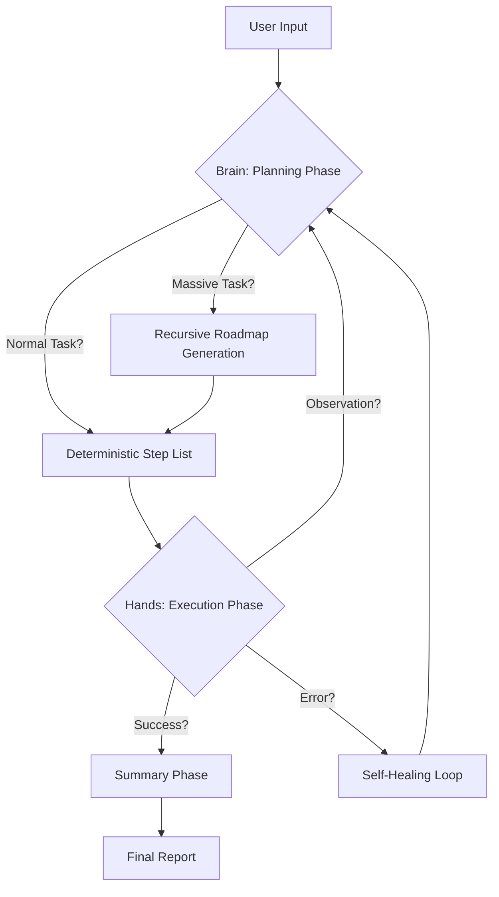

# 🤖 myAgent v2.0 — The "Conscious Asymmetry" Assistant

[](https://github.com/Mustafkgl/myAgent)
[](https://github.com/Mustafkgl/myAgent/tree/clean_architect)
[](https://github.com/Mustafkgl/myAgent)

```text
                              █████████
                             ███░░░░░███
 █████████████   █████ ████ ░███    ░███   ███████  ██████  ████████   █████
░░███░░███░░███ ░░███ ░███  ░███████████  ███░░███ ███░░███░░███░░███ ░░███
 ░███ ░███ ░███  ░███ ░███  ░███░░░░░███ ░███ ░███░███████  ░███ ░███ ███████
 ░███ ░███ ░███  ░███ ░███  ░███    ░███ ░███ ░███░███░░░   ░███ ░███░░░███░
 █████░███ █████ ░░███████  █████   █████░░███████░░██████  ████ ████  ░███
░░░░░ ░░░ ░░░░░   ░░░░░███ ░░░░░   ░░░░░  ░░░░░███ ░░░░░░  ░░░░ ░░░░░  ░███ ███
                  ███ ░███                ███ ░███                     ░░█████
                 ░░██████                ░░██████                       ░░░░░
                  ░░░░░░                  ░░░░░░
```

## 🌌 The Philosophy: Conscious Asymmetry

**myAgent** is built on a unique architectural signature: **Conscious Asymmetry**. Instead of using a single LLM for everything, we split the labor based on biological and cognitive strengths:

-   🧠 **The Brain (Claude-3.5-Opus/Sonnet):** Orchestrates logic, performs deep codebase research, and builds deterministic step-by-step plans.
-   🛠️ **The Hands (Gemini-2.5-Flash/Pro):** High-speed execution, complex tool usage, and real-time response generation.

By forcing a **JSON Contract** between the Brain and the Hands, we eliminate "hallucination drift" and achieve enterprise-grade reliability.

---

## 🏗️ Level 2 Clean Architecture

The `clean_architect` branch introduces a robust **Finite State Machine (FSM)** that drives the entire lifecycle of a task.

### System Flow


---

## 🚀 Key Features

### 🖥️ Next-Gen TUI
A highly responsive Terminal User Interface built with `Textual`. 
- **Live Process Tracking:** Watch Claude and Gemini think in real-time in the sidebar.
- **Responsive Design:** Zero-flicker UI that adapts to terminal resizing.
- **Integrated Sidebar:** Interactive directory tree and session history.

### 📡 Sustainable Model Discovery
Forget hardcoded lists. myAgent stays updated with the AI industry **autonomously**.
- **Live Sync:** Fetches the latest models (like Opus 4.7 or Gemini 3.1) directly from Anthropic and Google APIs on every launch.
- **Hybrid Selection:** Mix and match any model for any role via the `/model` screen.

### 📓 Black Box Recorder
Enterprise-grade traceability via `~/.myagent/myagent_debug.log`.
- Every state transition, every raw JSON payload, and every bash command is timestamped and mühürlendi.
- If it fails, the log tells you **exactly** why.

---

## 🛠️ Usage & Commands

### Slash Commands (Inside TUI)
| Command | Description |
| :--- | :--- |
| `/sessions` | List and manage your previous chat history. |
| `/load <id>` | Instantly restore a previous session. |
| `/model` | Dynamic screen to choose your Brain and Hands. |
| `/auth` | Update API keys with built-in **Connection Testing**. |
| `/doctor` | Run system-wide diagnostics and health checks. |
| `/clear` | Wipe the terminal screen for a fresh start. |

### Terminal Flags
```bash
myagent "task"             # Starts TUI mode
myagent --no-tui "task"    # Direct terminal output mode (REPL)
myagent --verbose          # Shows raw model outputs and debug info
```

---

## 🐳 Getting Started (Docker-First)

The most stable way to run myAgent is inside our optimized Docker environment.

1.  **Clone the Architecture:**
    ```bash
    git clone https://github.com/Mustafkgl/myAgent.git
    cd myAgent
    git checkout clean_architect
    ```

2.  **Build the Beast:**
    ```bash
    docker compose build
    ```

3.  **Awaken the Agent:**
    ```bash
    ./run.sh
    ```

4.  **Configure:** Type `/auth` inside the TUI to mühürle your API keys and test the connection.

---

## 🛡️ Security & Safety
- **Path Traversal Protection:** Executor validates all file writes against the workspace root.
- **Subprocess Isolation:** Bash commands run in a restricted environment with timeouts.
- **Credential Protection:** Secrets are never logged and are stored securely in `config.json`.

---

<p align="center">
  <i>"Conscious Asymmetry is not just a pattern, it's the future of AI-Human collaboration."</i><br>
  <b>Built with ❤️ by Mustafa</b>
</p>
