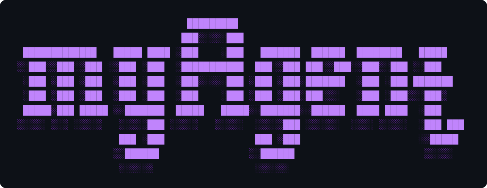
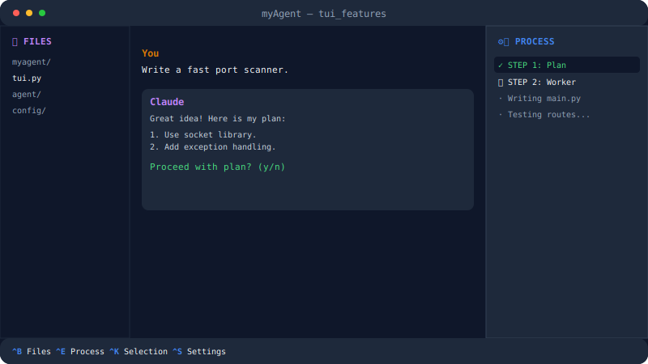
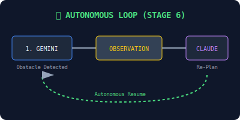
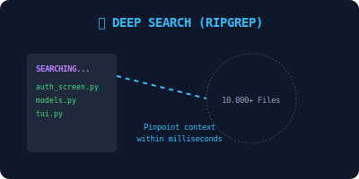
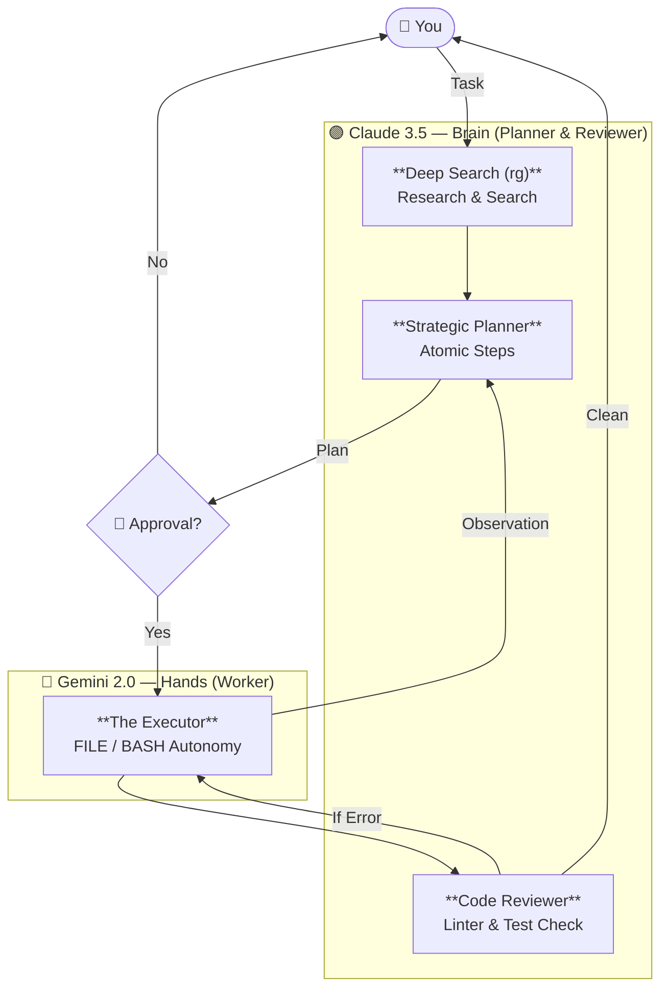

<div align="center">



### Claude Thinks — Gemini Works — You Just Target


**myAgent** is a high-performance AI Terminal assistant that combines the world's most advanced AI models (Claude and Gemini) into a single autonomous loop.

</div>

---

## 💡 Philosophy: Conscious Asymmetry

Most AI agents on the market use "expensive" models for every simple file read operation, quickly consuming your budget and limits. **myAgent** is different:

> It gives **Strategic Intelligence** (Planning and Reviewing) to Claude, and leaves the **Brute Force** (Code Writing and Terminal Execution) to Gemini.

Thanks to this asymmetric architecture, you can save **up to 90% in token costs** while building the same project as Claude Code. Claude only plans and reviews (low tokens), while Gemini writes thousands of lines of code in its free/cheap context.

---

## 🖥️ Next-Gen TUI (Terminal User Interface)

The innovations brought by the `tui_features` branch have transformed myAgent from a command-line tool into a full-fledged **AI-IDE** experience.

<div align="center">

<br/><em>Next-gen three-pane responsive interface</em>
</div>

### Featured UX Features:

*   **Live Process Tracking (Ctrl+E):** Monitor Claude's strategic steps and Gemini's live logs (ruff, pytest, bash) in real-time in the right panel.
*   **Integrated File Explorer (Ctrl+B):** View the project structure and navigate through directories in the left panel. Auto-collapses on narrow screens.
*   **Selection Mode (Ctrl+K):** Break free from terminal selection constraints. Manage the entire history in a selectable and copyable area.
*   **Instant Settings (Ctrl+S):** Change models, update API keys, and manage modes (Auto-approve, Dry-run) without leaving the app.
*   **Human-in-the-Loop:** Claude waits for your approval after planning. No files change until you say "Proceed".

---

## 🧠 Autonomous Power: Stage 6 Loop

myAgent no longer just writes code; it "researches" your project like an engineer and "stops to think when it makes a mistake":

<div align="center">
  
  
</div>

### 1. Deep Search (ripgrep)
With `ripgrep` integration, Claude scans the entire project (even millions of lines) in milliseconds before making a plan. You only need to provide the file name; myAgent finds the relevant code and adds it to its context.

### 2. Observation Mechanism
When Gemini encounters an obstacle (e.g., a file is not where planned or a library is missing), it doesn't just give an error. It analyzes the situation and presents an **OBSERVATION** report to Claude. Claude instantly updates its strategy based on this report.

### 3. Self-Healing
When the Reviewer layer (Linter and Tests) detects an error, the system enters an autonomous fix loop. Gemini and Claude pass the ball back and forth to perfect the code until tests pass (or max rounds are reached).

---

## 🚀 Architectural Flow



---

## ⌨️ Keyboard Shortcuts

| Key | Function |
|---|---|
| **`Ctrl+B`** | **Toggle File Explorer (Left Panel)** |
| **`Ctrl+E`** | **Toggle Process Tracking (Right Panel)** |
| **`Ctrl+K`** | **Selection Mode (Select & Copy)** |
| **`Ctrl+S`** | **Open Settings Modal** |
| `Ctrl+L` | Clear screen and logs |
| `Ctrl+Y` | Copy last AI response to clipboard |
| `↑` / `↓` | Navigate command history |
| `Tab` | Autocomplete commands |
| `F1` | Show help menu |
| `Ctrl+C` | Stop / Exit (Safe autosave) |

---

## 📦 Installation and Execution

### A — Docker (Recommended - Most Powerful Mode)
*In this mode, the agent works with full autonomy (`sed`, `g++`, etc. permissions) and stays isolated from your system.*

```bash
git checkout myAgent_EN
docker compose build
./run.sh
```

### B — Local venv (Fast Mode)
```bash
python -m venv .venv && source .venv/bin/activate
pip install -e .
python -m myagent
```

---

## 🛠️ Technical Features

- **Responsive TUI:** Automatically arranged interface based on screen size (Auto-collapse).
- **Git Checkpoint:** Automatic state saving and undo support before major changes.
- **Token Tracker:** Real-time cost analysis and "What if it were all Claude" comparison.
- **Docker Sandbox:** Full security sandbox for dangerous commands.

<div align="center">

---

*Claude Thinks. Gemini Works. myAgent Manages.*

</div>
