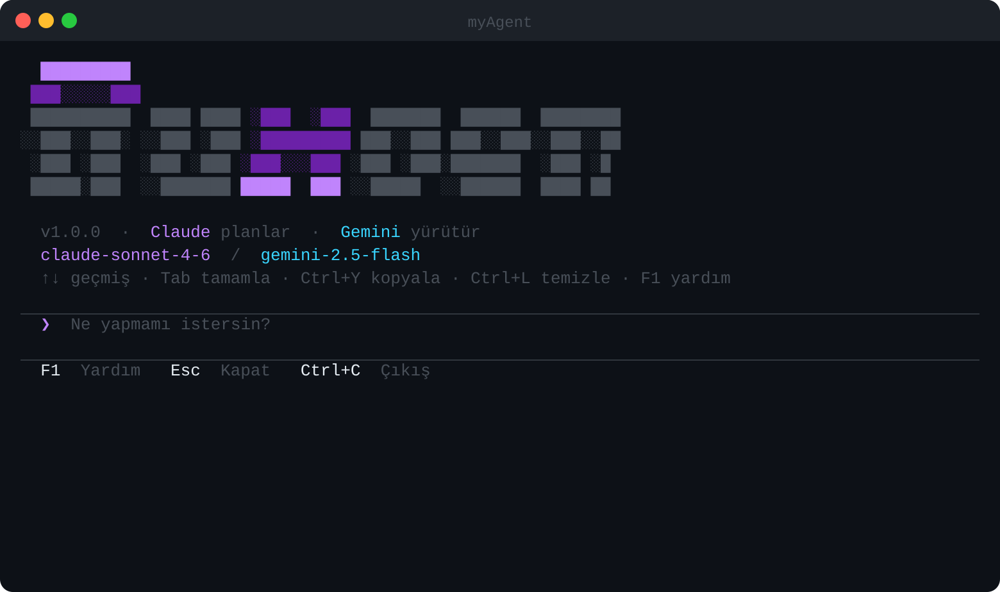
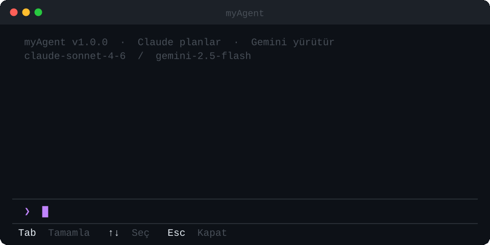
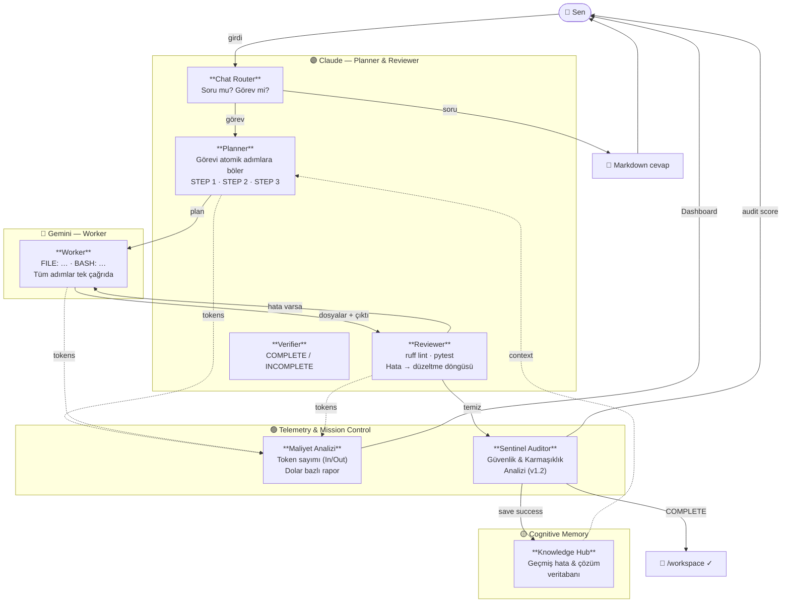
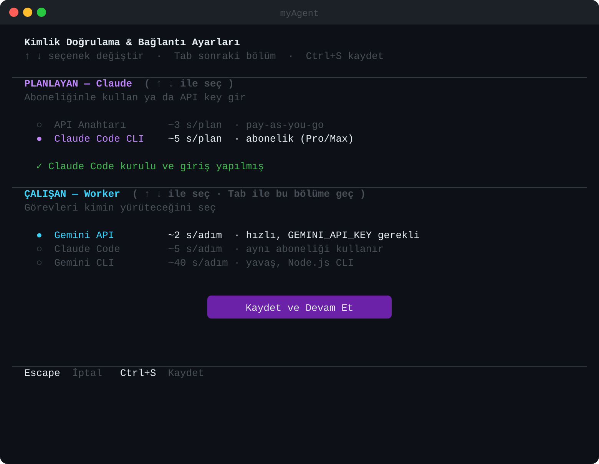
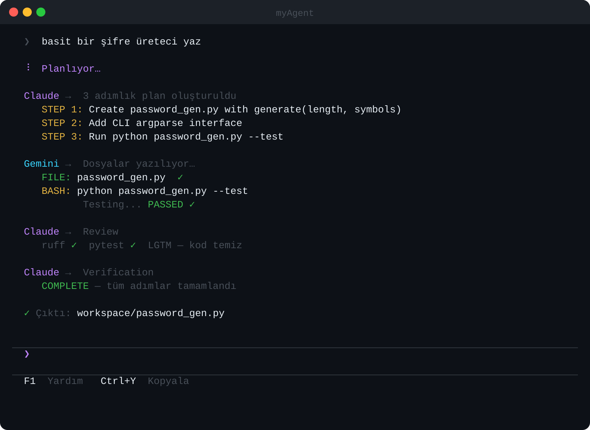

<div align="center">


### Claude düşünür — Gemini çalışır — Sen sadece ne istediğini söylersin


</div>

---

## Fikir

Çoğu AI ajanı aynı modeli tekrar tekrar çağırır. myAgent farklı bir yaklaşım benimser: **bilinçli asimetri.**

> Pahalı modeli sadece beyne ver. Bedava modeli kola.

Claude Code ile aynı işi yaparken token harcamanın onda birine çalışırsın — Claude yalnızca planlar ve inceler, Gemini tüm ağır işi ücretsiz (veya çok düşük maliyetli) olarak yürütür.

Yeni eklenen **Project OMEGA** (v1.2) güncellemesi ile sistem artık sadece kod yazmakla kalmaz; yazılan kodu denetler, güvenlik açıklarını tarar ve geçmiş hatalardan ders çıkararak her seferinde daha akıllı kararlar verir.

---

## Arayüz

<div align="center">

</div>

<br/>

<div align="center">

<br/><em>/ yazınca komut önerileri anında gelir</em>
</div>

---

## Mimari



---

## Özellikler

| | Özellik | Açıklama |
|---|---|---|
| **Arayüz** | Tam ekran TUI | Textual tabanlı, resize-responsive |
| | Slash komutları | `/` ile otomatik tamamlama |
| | REPL modu | `--no-tui` ile klasik terminal |
| | One-shot | `myagent "görev"` tek satırda çalışır |
| **Pipeline** | Çift model | Claude planlar + inceler, Gemini yürütür |
| | Review döngüsü | ruff + pytest + otomatik düzeltme |
| | Completion verify | Görev tamamlanmadan kapanmaz |
| **Hafıza** | Session kalıcılığı | Oturumlar kaydedilir, isimlendirilir |
| | Görev geçmişi | "bunu düzelt", "test ekle" doğal çalışır |
| **Teknik** | Canlı reflow | Terminal resize olunca anında yeniden düzenlenir |
| | Cross-platform | Windows · macOS · Linux |
| | Auth esnekliği | API key veya OAuth (Claude Code / Gemini CLI) |
| | Docker sandbox | Tam izole çalışma ortamı |
| **Analitik** | Maliyet Takibi | Token bazlı dolar hesabı |
| | Tasarruf Analizi | Hybrid vs Pure model karşılaştırması |
| | /stats | Detaylı finansal ve teknik rapor |
| | /telemetry | Canlı token sayacı kontrolü |
| | /sidebar | Mission Control yan panel (v1.2) |
| **Zeka** | Sentinel Audit | Otomatik güvenlik (bandit) ve karmaşıklık analizi |
| | Knowledge Hub | Geçmiş çözümlerden öğrenen kalıcı bellek |

---

## Kurulum

### Gereksinimler

| Gereksinim | Açıklama |
|---|---|
| Python 3.10+ | |
| **Claude için** | `ANTHROPIC_API_KEY` **ya da** Claude Code CLI (`claude login`) |
| **Gemini için** | `GEMINI_API_KEY` **ya da** Gemini CLI (`gemini login`) |

> Claude Code aboneliğin (Pro/Max) varsa API key gerekmez — myAgent direkt kullanır.

---

### Seçenek A — Python venv

```bash
git clone https://github.com/Mustafkgl/myAgent.git
cd myAgent
```

**Linux / macOS:**
```bash
python -m venv .venv && source .venv/bin/activate
pip install -e .
python -m myagent
```

**Windows:**
```powershell
python -m venv .venv; .venv\Scripts\Activate.ps1
pip install -e .
python -m myagent
```

### Seçenek B — Docker (önerilir)

`~/.claude`, `~/.gemini`, `~/.myagent` otomatik mount edilir.

```bash
cd myAgent
docker compose build
docker compose run --rm myagent
```

```bash
./run.sh                          # interaktif başlat
./run.sh "port scanner yaz"       # tek seferlik görev
./run.sh --build                  # rebuild + başlat
./run.sh --shell                  # container bash'ine gir
```

### İlk Çalıştırma

İlk açılışta kurulum sihirbazı çalışır. Sonradan `/auth` ve `/model` ile değiştirilebilir.

---

## Kullanım

Uygulama tam ekran TUI ile açılır. Claude her girdiyi otomatik değerlendirir: **soru mu → cevap**, **görev mi → pipeline**.

```
myagent> basit bir şifre üreteci yaz
myagent> buna GUI ekle
myagent> az önce yazdığın kodu açıkla
myagent> fibonacci nedir?
myagent> düzelt
myagent> test ekle
```

### Klavye Kısayolları

| Kısayol | Açıklama |
|---|---|
| `↑` / `↓` | Girdi geçmişinde gez |
| `Tab` | Slash komutunu otomatik tamamla |
| `Ctrl+Y` | Son AI cevabını panoya kopyala |
| `Ctrl+L` | Ekranı temizle |
| `F1` | Yardım |
| `Ctrl+C` | İlk basış uyarı verir, ikinci basış çıkış |
| `Esc` | Açık ekranı kapat |

### Slash Komutları

`/` yazmaya başlayınca altta otomatik tamamlama açılır.

| Komut | Açıklama |
|---|---|
| `/help` | Tüm komutları ve kısayolları göster |
| `/auth` | Kimlik doğrulama ekranı |
| `/model` | Model seçim ekranı |
| `/config` | Mevcut yapılandırmayı göster |
| `/doctor` | Sistem sağlık kontrolü ve diyagnostik |
| `/status` | Oturum istatistikleri |
| `/stats` | Detaylı token kullanımı ve maliyet analitiği |
| `/telemetry` | Canlı token sayacını aç / kapat |
| `/about` | Versiyon ve model bilgileri |
| `/think` | Verbose modunu aç / kapat |
| `/theme dark\|light` | Temayı değiştir |
| `/sessions` | Kayıtlı oturumları listele |
| `/load <n>` | Oturum yükle |
| `/rename <ad>` | Oturumu yeniden adlandır |
| `/new` | Yeni oturum başlat |
| `/export` | Oturumu Markdown dosyasına aktar |
| `/compact` | Konuşma geçmişini özetleyip sıkıştır |
| `/editor` | `$EDITOR` aç — çok satırlı giriş |
| `/clear` | Ekranı temizle |
| `/sidebar` | Mission Control panelini göster/gizle |
| `/exit` | Çıkış |

---

### Maliyet ve Telemetri

myAgent, "Bilinçli Asimetri" felsefesinin ne kadar tasarruf sağladığını size şeffaf bir şekilde sunar. Her görev sonunda harcanan toplam token miktarını ve gerçek maliyetini dolar bazında görebilirsiniz.

- **Estimated Savings (Tahmini Tasarruf):** Tüm sistemin Claude Opus (veya seçilen planlayıcı) ile çalışması durumunda oluşacak maliyet ile mevcut hibrit model arasındaki farkı gösterir.
- **Canlı Takip:** Görev sırasında hangi modelden ne kadar veri akışı olduğunu gerçek zamanlı izleme imkanı sunar.

<div align="center">

<br/><em>/stats komutu ile detaylı maliyet dökümü</em>
</div>

---

### /auth Ekranı

<div align="center">

</div>

### Görev Çalışırken

<div align="center">

</div>

---

## CLI Referansı

```
python -m myagent [GÖREV] [SEÇENEKLER]
```

| Seçenek | Açıklama |
|---|---|
| `--no-tui` | TUI yerine klasik REPL modunda başlat |
| `--claude-model MODEL` | Claude modeli — alias veya tam ID |
| `--gemini-model MODEL` | Gemini modeli — alias veya tam ID |
| `--work-dir PATH` | Dosya yazma dizini |
| `--max-steps N` | Maksimum plan adımı (varsayılan: 10) |
| `--dry-run` | Planı göster, yürütme |
| `--no-review` | Review döngüsünü atla |
| `--clarify` | Başlamadan önce netleştirme soruları sor |
| `--verbose` / `-v` | Ham model çıktısını göster |
| `--setup` | Kurulum sihirbazını çalıştır |
| `--list-models` | Mevcut modelleri listele |
| `--version` | Versiyon bilgisi |

**Model alias'ları:**

| Alias | Model |
|---|---|
| `opus` | `claude-opus-4-7` |
| `sonnet` | `claude-sonnet-4-6` |
| `haiku` | `claude-haiku-4-5-20251001` |
| `2.5-flash` | `gemini-2.5-flash` |
| `2.5-pro` | `gemini-2.5-pro` |
| `flash` | `gemini-2.0-flash` |

---

## Auth Yapılandırması

```json
{
  "claude_mode":  "cli",
  "claude_model": "claude-sonnet-4-6",
  "gemini_mode":  "api",
  "gemini_model": "gemini-2.5-flash"
}
```

| Sağlayıcı | Mod | Gereksinim |
|---|---|---|
| Claude | `api` | `ANTHROPIC_API_KEY` |
| Claude | `cli` | `claude` CLI + `claude login` |
| Gemini | `api` | `GEMINI_API_KEY` |
| Gemini | `cli` | `gemini` CLI + `gemini login` |

```bash
curl -fsSL https://claude.ai/install.sh | sh && claude login
npm install -g @google/gemini-cli && gemini login
```

---

## Proje Yapısı

```
myagent/
├── myagent/
│   ├── cli.py              ← REPL, argparse, SessionState
│   ├── tui.py              ← Textual TUI, slash komutları
│   ├── auth_screen.py      ← /auth ekranı
│   ├── model_screen.py     ← /model ekranı
│   ├── ui.py               ← Rich terminal (streaming, Live)
│   ├── interrupt.py        ← ESC / Ctrl+C yönetimi
│   ├── models.py           ← model kayıt defteri, canlı keşif
│   ├── setup_wizard.py     ← ilk çalıştırma sihirbazı
│   │
│   ├── agent/
│   │   ├── pipeline.py     ← tam döngü orkestrasyonu
│   │   ├── chat.py         ← soru ↔ görev yönlendirme
│   │   ├── planner.py      ← Claude → STEP listesi
│   │   ├── worker.py       ← Gemini → FILE/BASH çıktısı
│   │   ├── executor.py     ← güvenli dosya yazımı + komut
│   │   ├── reviewer.py     ← ruff + pytest + düzeltme döngüsü
│   │   ├── completer.py    ← tamamlama doğrulayıcı
│   │   └── deps.py         ← eksik pip paket tespiti
│   │
│   ├── memory/
│   │   └── history.py      ← kalıcı görev geçmişi (jsonl)
│   │
│   └── config/
│       ├── settings.py     ← sabitler, validate()
│       └── auth.py         ← mod/model tespiti, config I/O
│
├── docs/
├── docker-compose.yml
├── Dockerfile
└── run.sh
```

---

## Güvenlik

- **Path traversal koruması** — tüm dosya yazma işlemleri `WORK_DIR` içinde kontrol edilir
- **`shell=False`** — injection mümkün değil
- **`eval()` / `exec()` yok** — hiçbir yerde kullanılmaz
- **Docker sandbox** — `MYAGENT_DOCKER=1` ile tam izolasyon

| Dosya | İçerik |
|---|---|
| `~/.myagent/config.json` | Mod ve model tercihleri |
| `~/.myagent/.env` | API key'ler |
| `~/.myagent/sessions/*.json` | Oturum geçmişi |
| `~/.myagent/history.jsonl` | Görev geçmişi |

<div align="center">

---

*Claude düşünür. Gemini çalışır.*

</div>
