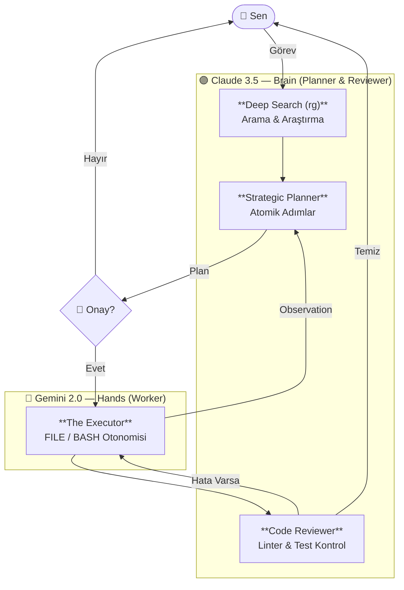

<div align="center">


### Claude Düşünür — Gemini Çalışır — Siz Sadece Hedeflersiniz


</div>

---

## 💡 Felsefe: Bilinçli Asimetri

Piyasadaki AI ajanlarının çoğu "pahalı" modelleri her basit dosya okuma işlemi için kullanarak bütçenizi ve limitlerinizi hızla tüketir. **myAgent** farklıdır:

> **Stratejik Zekayı** (Planlama ve İnceleme) Claude'a verir, **Kas Gücünü** (Kod Yazma ve Terminal Yürütme) Gemini'ye bırakır.

Bu sayede Claude Code ile aynı projeyi ayağa kaldırırken **token maliyetinden %90'a kadar tasarruf** edersiniz.

---

## 🖥️ Yeni Nesil TUI (Terminal Kullanıcı Arayüzü)

`tui_features` dalı ile gelen yenilikler, myAgent'ı bir komut satırı aracından tam teşekküllü bir **AI-IDE** deneyimine dönüştürdü:

- **Canlı Takip Paneli (Ctrl+E):** Sağ panelde Claude'un stratejik adımlarını ve Gemini'nin canlı loglarını anlık izleyin.
- **Entegre Dosya Gezgini (Ctrl+B):** Sol panelde proje yapısını görün, dizinler arasında gezinin.
- **Kelime Seçim Modu (Ctrl+K):** Terminalin kısıtlamalarından kurtulun; tüm geçmişi seçilebilir, cerrahi hassasiyette kopyalanabilir bir alanda yönetin.
- **Anlık Ayarlar (Ctrl+S):** Uygulamadan çıkmadan modelleri değiştirin, API anahtarlarını güncelleyin.
- **Human-in-the-Loop:** Claude planı bitirdiğinde onayınızı bekler. Siz "Yürü" diyene kadar hiçbir dosya değişmez.

<div align="center">

<br/><em>Yeni nesil üç panelli responsive arayüz</em>
</div>

---

## 🧠 Otonom Güç: Aşama 6 Döngüsü

myAgent artık sadece kod yazmıyor, projenizi bir mühendis gibi "araştırıyor" ve "hata yapınca durup düşünüyor":

1.  **Derin Arama (Deep Search):** `ripgrep` entegrasyonu sayesinde Claude, plan yapmadan önce tüm projeyi tarar, ilgili kodları bulur ve öyle karar verir.
2.  **Gözlem Mekanizması (Observation):** Gemini bir engelle karşılaşırsa (dosya eksik, yetki hatası vb.) bunu Claude'a raporlar. Claude anında stratejiyi güncelleyerek Gemini'ye yeni rotayı çizer.
3.  **Git Checkpoint:** Yapılan her büyük değişiklik öncesi sistem güvenliğini korur, otonom hata düzeltme döngüsüyle projenizi asla bozmaz.

---

## 🚀 Mimari Akış



---

## 🛠️ Özellikler Listesi

| | Özellik | Detay |
|---|---|---|
| **Zeka** | Hibrit Mimari | Claude Planlar/İnceler, Gemini Uygular |
| | Otonom Döngü | Hata anında kendi kendini düzelten (Self-healing) yapı |
| | Derin Okuma | `ripgrep` ile proje çapında bağlam (context) hakimiyeti |
| **UX** | Responsive TUI | Ekran boyutuna göre kendini ayarlayan üç panelli dizayn |
| | Seçim Modu | Mouse ile metin seçme ve kopyalama kolaylığı |
| | Ayarlar Modalı | Canlı model ve API yönetimi |
| **Güvenlik** | Docker Sandbox | `sed`, `rm`, `g++` gibi komutlar için tam izolasyon |
| | Onay Sistemi | Her kritik işlem için kullanıcı onayı (Bypass edilebilir) |
| **Maliyet** | Token Tracker | Anlık maliyet ve tasarruf analizi (`/status`) |
| | Otomatik Sıkıştırma | Konuşma geçmişini otonom özetleme (`/compact`) |

---

## ⌨️ Klavye Kısayolları

| Tuş | Fonksiyon |
|---|---|
| **`Ctrl+B`** | **Dosya Gezgini'ni (Sol Panel) aç / kapat** |
| **`Ctrl+E`** | **İşlem Takibi'ni (Sağ Panel) aç / kapat** |
| **`Ctrl+K`** | **Kelime Seçim Modu (Seç & Kopyala)** |
| **`Ctrl+S`** | **Ayarlar Modalını aç** |
| `Ctrl+L` | Ekranı ve logları temizle |
| `Ctrl+Y` | Son AI cevabını panoya kopyala |
| `↑` / `↓` | Komut geçmişinde gezin |
| `Tab` | Komutları otomatik tamamla |
| `F1` | Yardım menüsünü göster |
| `Ctrl+C` | Durdur / Çıkış (Güvenli autosave) |

---

## 📦 Kurulum ve Çalıştırma

### A — Docker (Önerilen - En Güçlü Mod)
*Bu modda ajan tam otonomi ile çalışır ve sisteminizden izole kalır.*

```bash
docker compose build
./run.sh
```

### B — Lokal venv (Hızlı Mod)
```bash
python -m venv .venv && source .venv/bin/activate
pip install -e .
python -m myagent
```

---

## 📁 Dosya Yapısı

- `myagent/tui.py`: Modern Textual arayüzü ve kısayollar.
- `myagent/agent/pipeline.py`: Claude ↔ Gemini otonom döngüsü.
- `myagent/agent/planner.py`: `ripgrep` tabanlı derin araştırma mantığı.
- `myagent/agent/executor.py`: Güvenli dosya yazma ve BASH yönetimi.

<div align="center">

---

*Claude Düşünür. Gemini Çalışır. myAgent Yönetir.*

</div>
